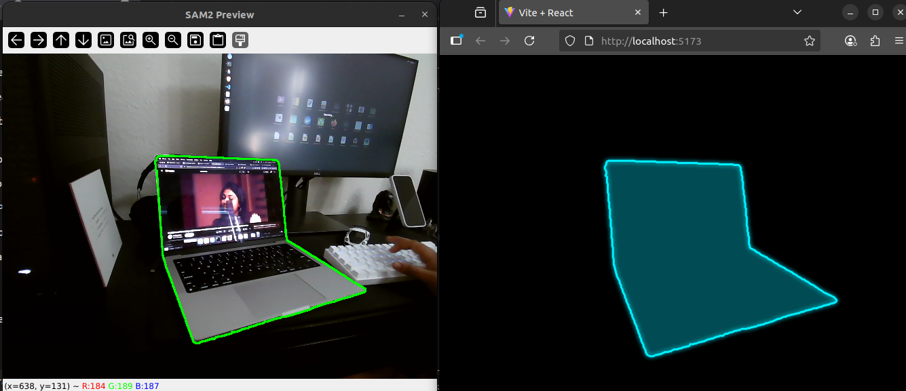

# Segment Anything with Live Projection Mapping



This project integrates **Segment Anything v2 (SAM2.1)** with real-time projection mapping, enabling live segmentation and visualization 

##  Getting Started

### 1. Create and activate the environment

```bash
conda create -n sam2projection python=3.10 -y
conda activate sam2projection
```

### 2. Install dependencies

```bash
cd sam2
pip install -e .
```

### 3. Download SAM2 checkpoints

```bash
cd checkpoints/sam2
./download_ckpts.sh
cd ../..
```

##  Check your camera

Run the camera checker script to see which camera ports are available:

```bash
python3 checkcamera.py
```

You'll get output like:
```
Available camera ports: [0]
```

Use the listed port (e.g., `0`) in the next step.

##  Run the segmentation server

You can choose one of the following model sizes: **tiny, small, base, large**. 

Example using `small` model:

```bash
python3 sam2_server.py \
  --model_version sam2.1 \
  --model_size small \
  --sock_host 0.0.0.0 \
  --sock_port 5001 \
  --camera 0
```

### Parameters:
- `--model_version`: Choose between `sam2` and `sam2.1`
- `--model_size`: One of `tiny | small | base | large`
- `--camera`: The camera port you found earlier (default `0`)
- `--sock_host` / `--sock_port`: Configure the backend API and WebSocket server

##  Run the web frontend

### 1. Navigate to web directory
```bash
cd ../web
```

### 2. Configure backend URL
Set the backend URL in your `.env` file:
```
VITE_SOCKET_URL=http://127.0.0.1:5001
```

### 3. Install and start the development server
```bash
npm install
npm run dev
```

### 4. Open in browser
Open the provided local URL in your browser to see the projection of the selected boundaries.

##  Technical Notes

- The frontend is a **simple React app** to demonstrate how the backend can be used
- You can adapt or extend it for your own projection mapping use cases
- Real-time segmentation is powered by SAM2's advanced computer vision capabilities


##  Requirements

- Python 3.10+
- CUDA /ROCm installed libraries (optional, for GPU acceleration)
- Webcam or compatible camera device
- Node.js and npm (for frontend)

## Future Improvements

YOLO Integration for Scene Understanding
The project can be enhanced by integrating YOLO (You Only Look Once) object detection to provide intelligent scene understanding and context-aware projection mapping:


## Example Use Cases:

Interactive Art Installations: Project different effects on people vs. static objects
Retail Applications: Highlight products detected by YOLO with SAM2-precise boundaries
Educational Tools: Identify and segment specific objects for learning applications to make engaging IRL presentations
